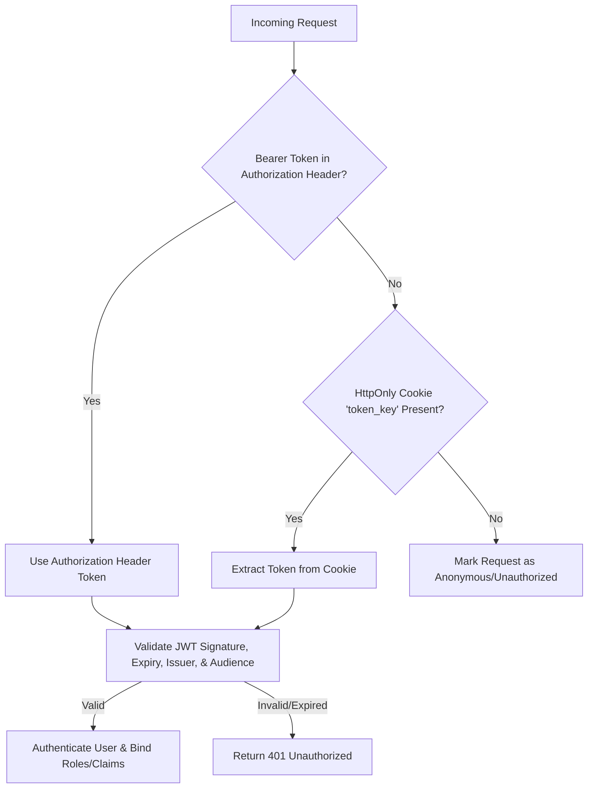
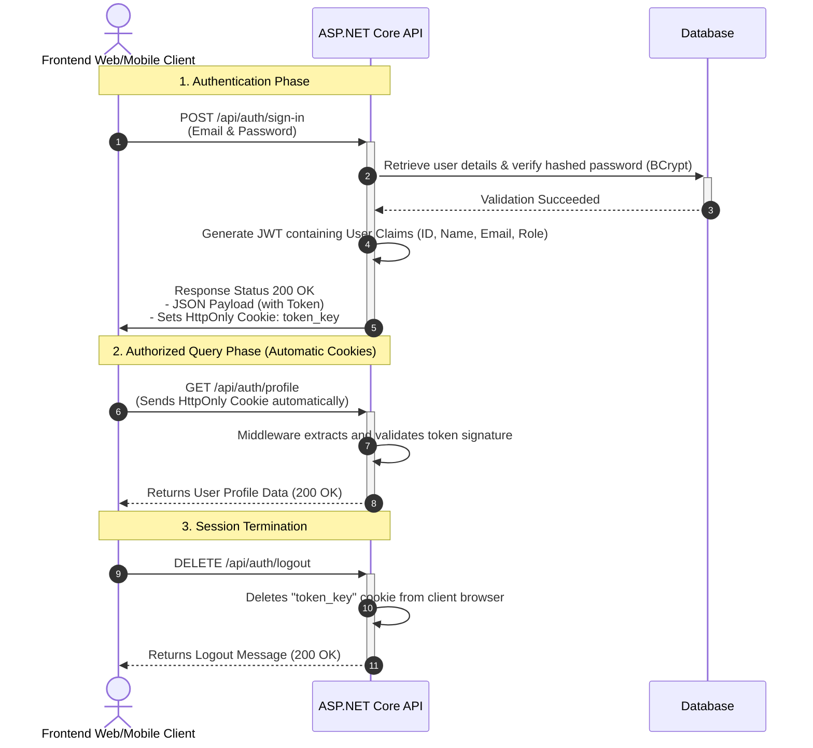

# 🏢 ARDH Property Management Backend API Documentation

Welcome to the **ARDH Property Management** API documentation. This guide is designed to explain the API structure, endpoint specifications, and authentication architecture to both developers and project stakeholders.

The backend is built using **ASP.NET Core 8.0** following **Clean Architecture** principles.

---

## 🔒 Authentication Architecture: JWT & HttpOnly Cookies

The system implements a **hybrid authentication pipeline** that combines the flexibility of **JSON Web Tokens (JWT)** with the high security of **HttpOnly Cookies**. This ensures robust defense against common web vulnerabilities while maintaining full compatibility with diverse clients (web apps, mobile apps, and third-party integrations).

### 1. Dual-Token Delivery Model
When a user logs in via `/api/auth/sign-in` or requests a token renewal via `/api/auth/refresh`, the API delivers the JWT in two ways simultaneously:
1. **JSON Response Body**: Returns the JWT string as `token` in the response payload.
2. **HttpOnly Cookie**: Automatically appends a cookie named `token_key` containing the token to the HTTP response headers.

### 2. Cookie Security Attributes
To prevent unauthorized access and theft of user sessions, the `token_key` cookie is configured with the following industry-standard security flags:

*   **`HttpOnly = true`**: The cookie cannot be accessed via client-side JavaScript (e.g., `document.cookie`). This completely mitigates **Cross-Site Scripting (XSS)** token theft.
*   **`Secure = true` (HTTPS only)**: The cookie is only transmitted over encrypted connections, shielding it from **Man-in-the-Middle (MITM)** sniffing.
*   **`SameSite = None` (HTTPS) / `Lax` (HTTP Dev)**: Under HTTPS, `SameSite=None` allows the frontend client hosted on a different domain to send the credential cookie seamlessly during cross-origin API calls. During local development over HTTP, it falls back to `Lax` to allow standard request flows.
*   **`MaxAge = 30 minutes`**: Limits the token lifespan to prevent session hijacking from abandoned devices.

### 3. Smart Extraction Pipeline
Our backend authorization middleware automatically resolves user identity by checking for credentials in two locations in order of priority:



---

## 🔄 Authentication Flow Sequence

The sequence diagram below visualizes how the frontend client interacts with the API during sign-in, profile retrieval, and sign-out:



---

## 📑 API Endpoint Catalog

---

### 🔓 Group 1: Authentication Endpoints (`/api/auth`)
These endpoints manage user sessions, profile details, and password recovery.

#### 1. Sign In (Login)
*   **Route**: `POST /api/auth/sign-in`
*   **Access**: Public
*   **Description**: Authenticates user credentials. Sets the `token_key` cookie and returns the token details.
*   **Request Body (`UserSignInRequest`)**:
    ```json
    {
      "email": "admin@gmail.com",
      "password": "P@ssw0rd",
      "rememberMe": true
    }
    ```
*   **Response (200 OK - `UserSignInResponse`)**:
    ```json
    {
      "id": "a3f5b721-39c4-42b8-bd29-c8be5d491f24",
      "name": "Super Admin",
      "email": "admin@gmail.com",
      "role": "Admin",
      "token": "eyJhbGciOiJIUzI1NiIsInR5cCI6IkpXVCJ9..."
    }
    ```

#### 2. Get Current Profile
*   **Route**: `GET /api/auth/profile`
*   **Access**: Authenticated (Requires valid JWT Cookie or Bearer Token)
*   **Description**: Returns details about the currently signed-in user.
*   **Response (200 OK - `UserProfileResponse`)**:
    ```json
    {
      "id": "a3f5b721-39c4-42b8-bd29-c8be5d491f24",
      "name": "Super Admin",
      "email": "admin@gmail.com",
      "phone": "+1234567890",
      "role": "Admin",
      "address": "123 Main St",
      "avatarUrl": "https://example.com/avatar.png",
      "isActive": true,
      "permissions": "read:all",
      "lastLoginAt": "2026-07-12T19:54:27Z"
    }
    ```

#### 3. Refresh Token
*   **Route**: `GET /api/auth/refresh`
*   **Access**: Authenticated
*   **Description**: Regenerates a fresh JWT and updates the HttpOnly session cookie, extending the session.
*   **Response (200 OK)**:
    ```json
    "eyJhbGciOiJIUzI1NiIsInR5cCI6IkpXVCJ9..."
    ```

#### 4. Forgot Password (Request OTP)
*   **Route**: `POST /api/auth/forgot-password`
*   **Access**: Public
*   **Description**: Generates a temporary 6-digit numeric OTP for password recovery, valid for 10 minutes.
*   **Request Body (`ForgotPasswordRequest`)**:
    ```json
    {
      "email": "user@gmail.com"
    }
    ```
*   **Response (200 OK)**:
    ```json
    {
      "message": "Password reset OTP sent to email."
    }
    ```
    > [!NOTE]
    > For local development, the generated OTP is logged to the backend console application log to bypass SMTP email requirements.

#### 5. Verify OTP
*   **Route**: `POST /api/auth/verify-otp`
*   **Access**: Public
*   **Description**: Validates that the submitted OTP is correct and has not expired.
*   **Request Body (`VerifyOtpRequest`)**:
    ```json
    {
      "email": "user@gmail.com",
      "otp": "654321"
    }
    ```
*   **Response (200 OK)**:
    ```json
    {
      "message": "OTP verified successfully. You can now reset your password."
    }
    ```

#### 6. Reset Password
*   **Route**: `POST /api/auth/reset-password`
*   **Access**: Public
*   **Description**: Resets the password if the OTP validation succeeds.
*   **Request Body (`ResetPasswordRequest`)**:
    ```json
    {
      "email": "user@gmail.com",
      "otp": "654321",
      "newPassword": "newSecurePassword123!",
      "confirmNewPassword": "newSecurePassword123!"
    }
    ```
*   **Response (200 OK)**:
    ```json
    {
      "message": "Password has been reset successfully."
    }
    ```

#### 7. Logout
*   **Route**: `DELETE /api/auth/logout`
*   **Access**: Public / Authenticated
*   **Description**: Clears the authentication state by requesting client browsers to delete the `token_key` cookie.
*   **Response (200 OK)**:
    ```json
    {
      "message": "Successfully logged out."
    }
    ```

---

### 🛡️ Group 2: User Management Endpoints (`/api/users`)
*All endpoints in this group require a valid administrator session (`SuperAdmin` or `Admin` role).*

#### U-01. List Users
*   **Route**: `GET /api/users`
*   **Query Parameters**:
    *   `page` *(integer, default: 1)*: Page number.
    *   `pageSize` *(integer, default: 10)*: Number of items per page.
    *   `search` *(string, optional)*: Search match for Name, Email, or Phone.
    *   `role` *(integer enum, optional)*: Filter by role.
    *   `is_active` *(boolean, optional)*: Filter active/inactive users.
*   **Response (200 OK - `PaginatedList<UserViewModel>`)**:
    ```json
    {
      "items": [
        {
          "id": "c1f7b822-29c4-52a8-ad29-c8be5d491f24",
          "name": "Jane Doe",
          "email": "jane@gmail.com",
          "phone": "+1987654321",
          "address": "456 Oak Avenue",
          "role": "Admin",
          "avatarURL": "https://example.com/jane.jpg",
          "isActive": true,
          "permissions": "read:all",
          "lastLoginAt": "2026-07-12T18:30:00Z",
          "createdAt": "2026-07-11T12:00:00Z",
          "updatedAt": "2026-07-12T18:30:00Z"
        }
      ],
      "page": 1,
      "pageSize": 10,
      "totalCount": 1
    }
    ```

#### U-02. Get User By ID
*   **Route**: `GET /api/users/{id}`
*   **Response (200 OK - `UserViewModel`)**: Returns the full details of a specific user.

#### U-03. Create User
*   **Route**: `POST /api/users`
*   **Request Body (`UserCreateRequest`)**:
    ```json
    {
      "name": "John Tenant",
      "email": "john.t@gmail.com",
      "phone": "+15550199",
      "password": "Password123!",
      "confirmPassword": "Password123!",
      "address": "Suite 4B, Plaza Towers",
      "role": "Admin",
      "permissions": "read:properties",
      "avatarURL": "https://example.com/john.jpg"
    }
    ```
*   **Response (200 OK)**:
    ```json
    {
      "message": "User created successfully."
    }
    ```

#### U-04. Update User
*   **Route**: `PUT /api/users/{id}`
*   **Request Body (`UserUpdateRequest`)**:
    ```json
    {
      "name": "John Tenant Updated",
      "email": "john.t@gmail.com",
      "phone": "+15550199",
      "address": "Suite 5A, Plaza Towers",
      "role": "Admin",
      "isActive": true,
      "permissions": "read:properties,write:properties",
      "avatarURL": "https://example.com/john.jpg"
    }
    ```
*   **Response (200 OK)**:
    ```json
    {
      "message": "User updated successfully."
    }
    ```

#### U-05. Soft Delete User
*   **Route**: `DELETE /api/users/{id}`
*   **Description**: Marks a user account as deleted by setting a deletion timestamp and updating the state to inactive without physical deletion, preserving data auditing.
*   **Response (200 OK)**:
    ```json
    {
      "message": "User deleted successfully."
    }
    ```

#### U-06. Toggle User Status
*   **Route**: `PATCH /api/users/{id}/toggle-status`
*   **Description**: Instantly toggles the `IsActive` state between `true` and `false`, allowing administrators to temporarily lock/unlock user access.
*   **Response (200 OK)**:
    ```json
    {
      "message": "User status toggled successfully."
    }
    ```

---

## 🛡️ Default Seed Credentials

For quick deployment and local testing, the following default accounts are seeded upon starting the database:

| Full Name | Email Address | Role | Password |
| :--- | :--- | :--- | :--- |
| **Super Admin** | `admin@gmail.com` | `Admin` | `P@ssw0rd` |
| **Property Manager** | `manager@gmail.com` | `PropertyManager` | `P@ssw0rd` |
